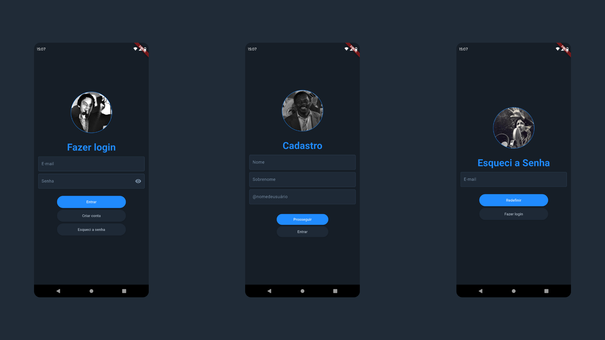
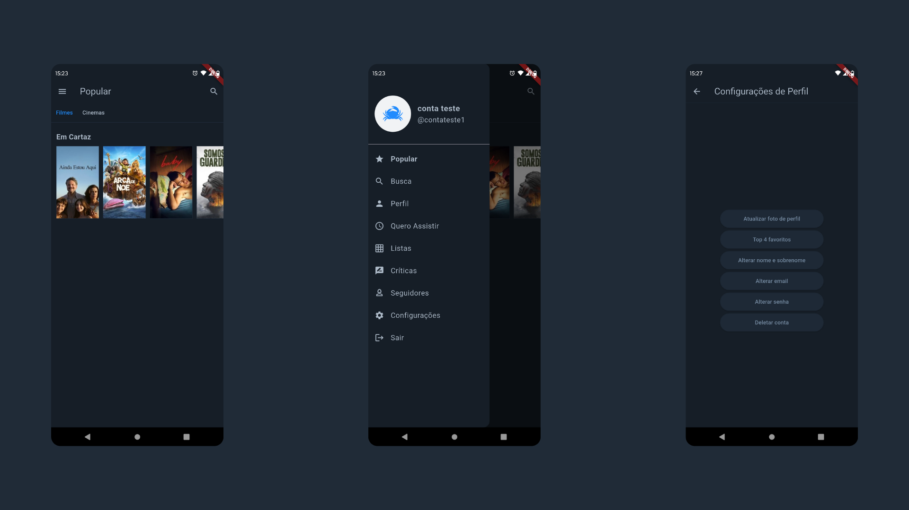
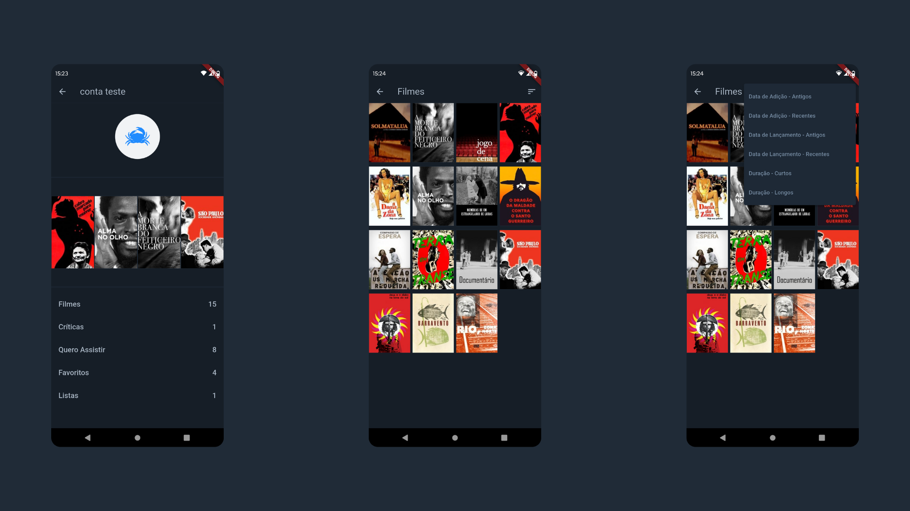
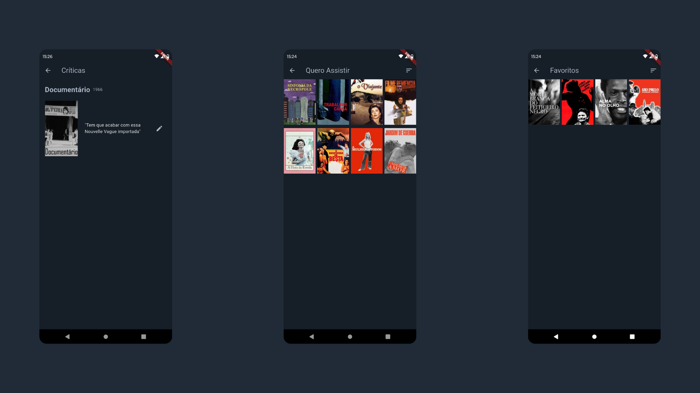
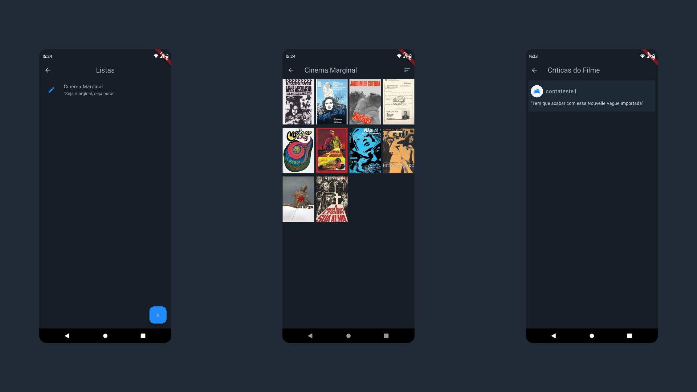
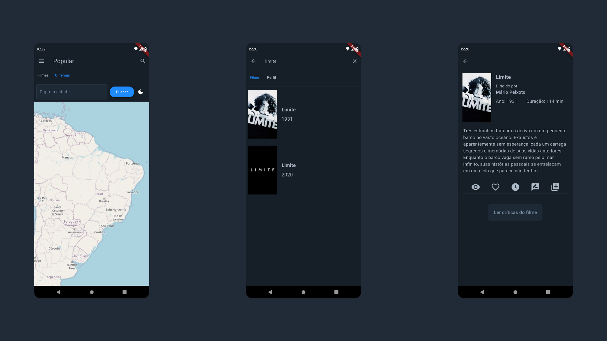
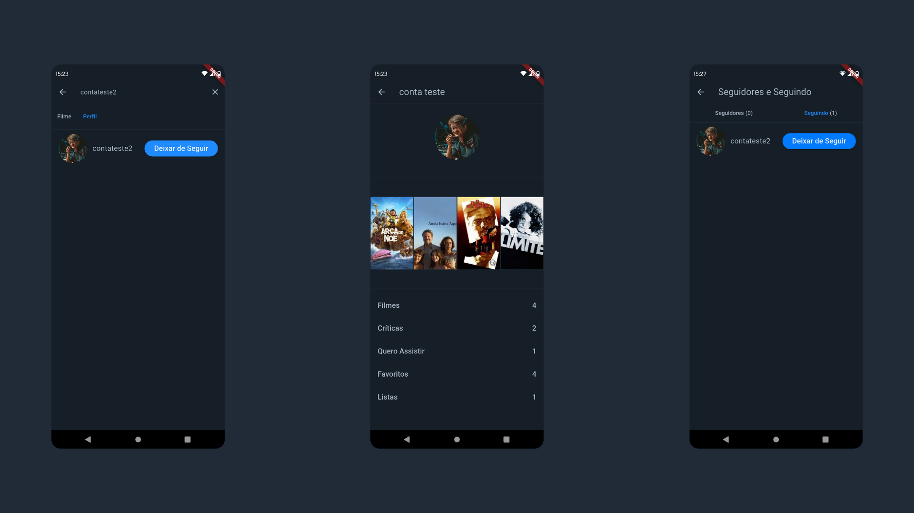

# FilmIn

**FilmIn** é um aplicativo mobile desenvolvido em **Flutter** que combina **descoberta de filmes**, **organização pessoal** e **recursos sociais** para amantes de cinema.  
Projeto desenvolvido no contexto da disciplina **Desenvolvimento de Sistemas de Informação**.

---

## Sobre o projeto

O FilmIn foi pensado para oferecer uma experiência completa para quem gosta de acompanhar lançamentos, montar uma biblioteca pessoal e interagir com outras pessoas por meio de perfis e avaliações.

### O que você pode fazer no app
- Marcar filmes como **Assistidos**, **Quero assistir** e **Favoritos**
- Escrever e visualizar **críticas**
- Criar e gerenciar **listas personalizadas**
- Explorar **filmes em cartaz**
- Encontrar **cinemas próximos** por meio de **mapa interativo**
- Descobrir usuários, **seguir** perfis e acompanhar **seguidores/seguindo**

---

## Funcionalidades em destaque

### Biblioteca e organização
- Gestão de filmes por status (assistido / quero assistir / favorito)
- Filtros para organização e navegação
- Listas customizadas para curadoria pessoal

### Críticas e social
- Publicação e visualização de críticas
- Perfis de usuários
- Sistema de seguidores/seguindo

### Descoberta e localização
- Filmes em cartaz e busca por título
- Mapa interativo para localização de cinemas com **OpenStreetMap (OSM)**

---

## Capturas de tela

**Acesso e conta**  
  
> Autenticação, criação de conta e recuperação de senha.

**Home, navegação e ajustes**  
  
> Filmes em cartaz, menu lateral e configurações do app.

**Perfil e biblioteca pessoal**  
  
> Perfil, filmes assistidos e filtros de organização.

**Críticas e favoritos**  
  
> Críticas publicadas, “quero assistir” e favoritos.

**Listas e detalhes**  
  
> Listas personalizadas, detalhes e visualização de crítica.

**Pesquisa e cinemas (OSM)**  
  
> Busca por cinemas, busca por filmes e página de detalhes.

**Sistema social**  
  
> Descoberta de usuários, perfis e seguidores/seguindo.

---

## Tecnologias e integrações

- **Flutter (Dart)** — desenvolvimento multiplataforma
- **Firebase Authentication** — autenticação de usuários
- **Supabase Storage** — armazenamento de foto de perfil
- **TMDB API** — catálogo e informações de filmes
- **OpenStreetMap (OSM)** — mapa e recursos de localização

---

## Privacidade e credenciais

Por questões de segurança, **chaves e configurações sensíveis não são disponibilizadas publicamente**.

---

## Colaboradores

- [Guilherme](https://github.com/Morpheus720)
- [Lucas](https://github.com/lpauloaraujo)
- [Marcos](https://github.com/Markin005)
- [Tiago](https://github.com/tigsg)

---

## Licença

Este projeto está sob a licença **Apache 2.0**. Consulte o arquivo de licença do repositório para mais detalhes.
